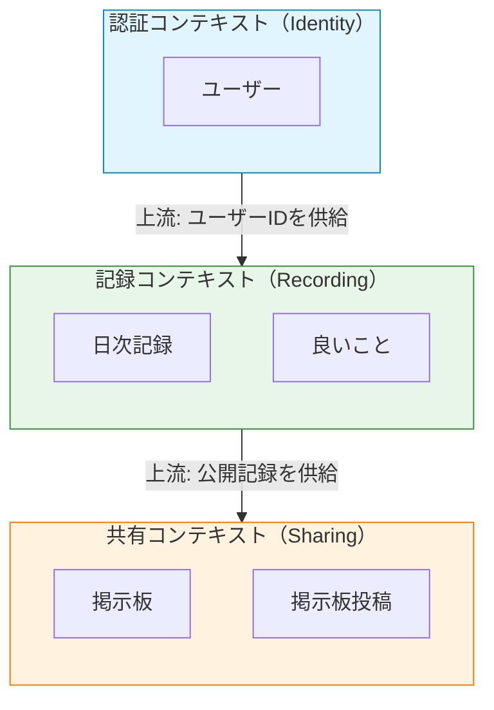
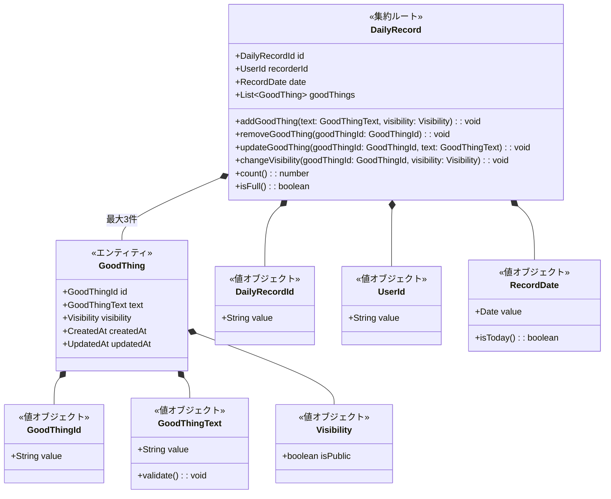
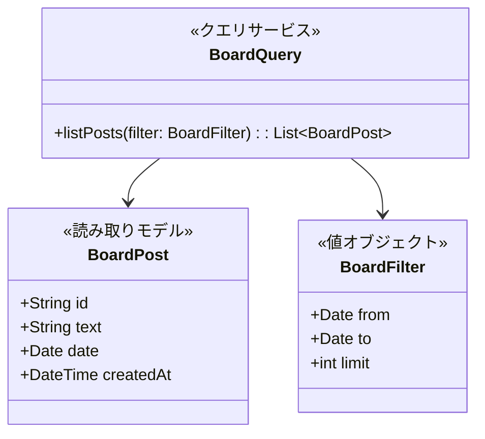
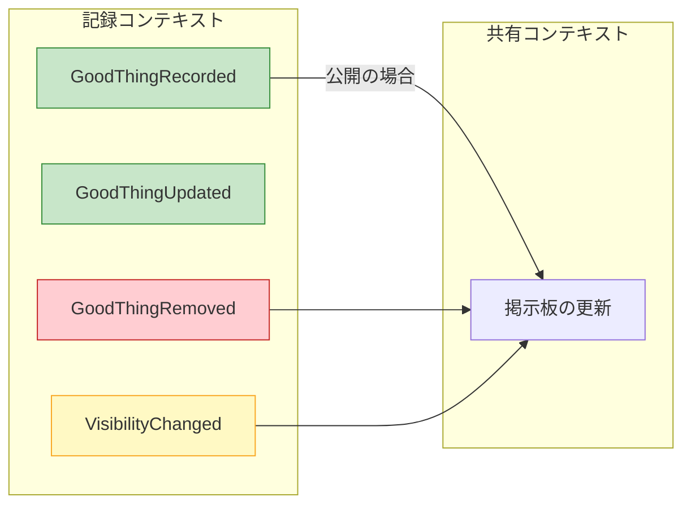
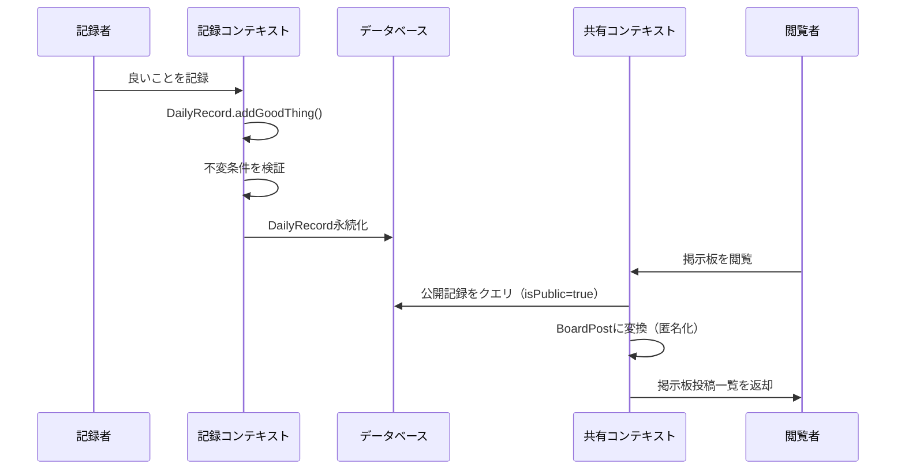
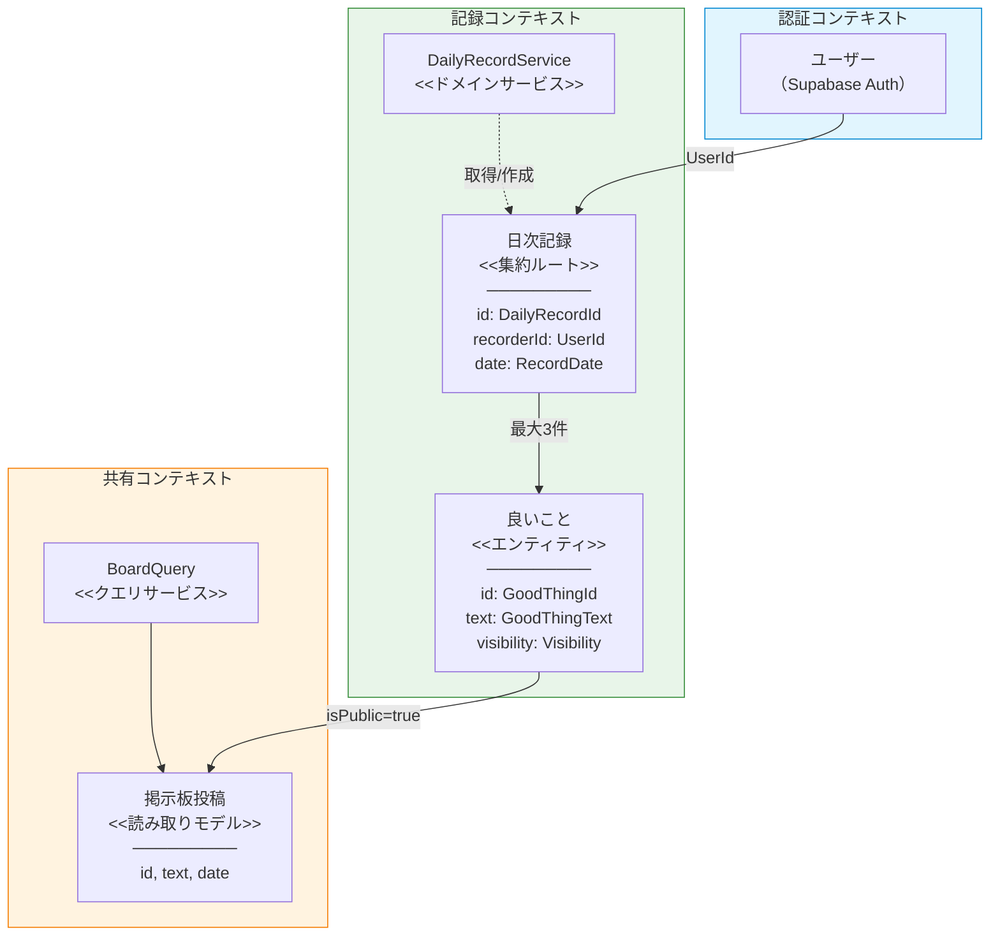

# ドメインモデリング設計書

## 目次

1. [ユビキタス言語](#1-ユビキタス言語)
2. [境界づけられたコンテキスト](#2-境界づけられたコンテキスト)
3. [集約設計](#3-集約設計)
4. [ドメインイベント](#4-ドメインイベント)
5. [ドメインサービス](#5-ドメインサービス)
6. [設計の根拠と検討事項](#6-設計の根拠と検討事項)

---

## 1. ユビキタス言語

本アプリケーション「GoodSpot」のドメインで使用する共通用語を定義する。開発者とビジネス関係者が同じ言葉で会話するための基盤となる。

### 用語集

| 用語           | 英語名          | 定義                                                                        | 補足                                                               |
| -------------- | --------------- | --------------------------------------------------------------------------- | ------------------------------------------------------------------ |
| **良いこと**   | GoodThing       | ユーザーが記録する「良かった出来事」の1件分。短文（1〜140文字）で表現される | 記録アイテムとも呼ばれるが、ドメインでは「良いこと」に統一する     |
| **日次記録**   | DailyRecord     | ある1日分の「良いこと」をまとめた単位。最大3件の良いことを含む              | 記録の管理単位であり、日付とユーザーの組み合わせで一意に識別される |
| **記録日**     | RecordDate      | 良いことが起きた日付。日次記録を識別する日付                                | 記録対象は当日のみ（過去日への遡り記録は不可）                     |
| **記録者**     | Recorder / User | 良いことを記録するユーザー。認証済みのログインユーザー                      | 認証コンテキストでは「ユーザー」、記録コンテキストでは「記録者」   |
| **公開設定**   | Visibility      | 良いことを掲示板に公開するかどうかの設定                                    | デフォルトは「公開」。良いこと単位で制御する                       |
| **掲示板**     | Board           | 全国の公開された良いことを時系列で一覧表示する機能                          | 完全匿名で表示される。誰の記録かは表示しない                       |
| **掲示板投稿** | BoardPost       | 掲示板に表示される匿名化された良いことの表現                                | 元の良いことから記録者情報を除外した読み取り専用データ             |
| **振り返り**   | Reflection      | 自分の過去の日次記録を見返す行為・機能                                      | 日付単位で自分の記録を閲覧する                                     |
| **記録上限**   | DailyLimit      | 1日あたりの記録可能件数の上限（3件）                                        | ドメインの核心的な不変条件                                         |

### コンテキスト別の用語の使い分け

| 用語     | 記録コンテキスト      | 共有コンテキスト        | 認証コンテキスト |
| -------- | --------------------- | ----------------------- | ---------------- |
| ユーザー | 記録者（Recorder）    | 閲覧者（Viewer）        | ユーザー（User） |
| 良いこと | 良いこと（GoodThing） | 掲示板投稿（BoardPost） | -                |
| 日付     | 記録日（RecordDate）  | 投稿日（PostDate）      | -                |

---

## 2. 境界づけられたコンテキスト

### 2.1 コンテキストマップ



### 2.2 各コンテキストの詳細

#### 認証コンテキスト（Identity Context）

- **責務**: ユーザーの認証・識別
- **範囲**: ログイン、ユーザー識別情報の管理
- **備考**: Supabase Authに委譲する外部コンテキスト。本ドメインでは深くモデリングしない
- **提供するもの**: ユーザーID（UUID）

#### 記録コンテキスト（Recording Context）

- **責務**: 良いことの記録・管理・振り返り
- **範囲**: 日次記録の作成、良いことの登録・編集・削除、公開設定の管理、振り返り表示
- **核心的なビジネスルール**:
  - 1日最大3件の記録上限
  - 1件あたり1〜140文字
  - 記録者本人のみが編集・削除可能
- **主要な集約**: 日次記録（DailyRecord）

#### 共有コンテキスト（Sharing Context）

- **責務**: 公開された良いことの匿名掲示板表示
- **範囲**: 掲示板の閲覧、時系列表示、フィルタリング
- **特徴**:
  - 読み取り専用（CQRS的な性質）
  - 完全匿名（記録者情報を持たない）
  - 記録コンテキストの公開データから導出される

### 2.3 コンテキスト間の関係

| 上流             | 下流             | 関係タイプ                           | 説明                                                                                             |
| ---------------- | ---------------- | ------------------------------------ | ------------------------------------------------------------------------------------------------ |
| 認証コンテキスト | 記録コンテキスト | **順応者（Conformist）**             | 記録コンテキストはSupabase Authが提供するユーザーIDをそのまま受け入れる                          |
| 記録コンテキスト | 共有コンテキスト | **顧客-供給者（Customer-Supplier）** | 記録コンテキストが公開フラグ付きの記録データを供給し、共有コンテキストがそれを匿名化して表示する |

### 2.4 コンテキスト境界の根拠

**なぜ「記録」と「共有」を分けるのか**:

- **言語が異なる**: 記録コンテキストでは「良いこと」「記録者」「日次記録」だが、共有コンテキストでは「掲示板投稿」「閲覧者」であり、同じデータが異なる意味を持つ
- **関心事が異なる**: 記録は「自分の良いことを管理する」、共有は「匿名で公開された良いことを一覧する」という異なるビジネス関心を持つ
- **匿名性の保証**: 共有コンテキストでは記録者情報を意図的に除外する必要がある。これは単なるフィルタリングではなく、コンテキスト境界による設計上の制約として扱う

**なぜ「認証」を独立コンテキストにするのか**:

- Supabase Authという外部サービスに委譲しており、本ドメインの制御範囲外
- 記録コンテキストはユーザーIDのみを必要とし、認証の詳細に依存しない

---

## 3. 集約設計

### 3.1 記録コンテキストの集約

#### 集約: 日次記録（DailyRecord）

**目的**: ある記録者のある1日分の「良いこと」をまとめて管理し、1日3件の記録上限を保護する。



##### 集約ルート: DailyRecord

| プロパティ | 型                | 説明                       |
| ---------- | ----------------- | -------------------------- |
| id         | DailyRecordId     | 日次記録の一意識別子       |
| recorderId | UserId            | 記録者のユーザーID         |
| date       | RecordDate        | 記録日                     |
| goodThings | List\<GoodThing\> | 良いことのリスト（0〜3件） |

| 操作                                      | 説明                         | 事前条件                       |
| ----------------------------------------- | ---------------------------- | ------------------------------ |
| addGoodThing(text, visibility)            | 良いことを追加する           | 件数が3件未満であること        |
| removeGoodThing(goodThingId)              | 良いことを削除する           | 指定IDの良いことが存在すること |
| updateGoodThing(goodThingId, text)        | 良いことのテキストを更新する | 指定IDの良いことが存在すること |
| changeVisibility(goodThingId, visibility) | 公開設定を変更する           | 指定IDの良いことが存在すること |
| count()                                   | 現在の良いこと件数を返す     | -                              |
| isFull()                                  | 記録上限に達しているか       | -                              |

##### エンティティ: GoodThing（良いこと）

日次記録に含まれる個別の「良いこと」。集約内部のエンティティであり、DailyRecordを通じてのみアクセスされる。

| プロパティ | 型            | 説明                 |
| ---------- | ------------- | -------------------- |
| id         | GoodThingId   | 良いことの一意識別子 |
| text       | GoodThingText | 良いことの本文       |
| visibility | Visibility    | 公開設定             |
| createdAt  | CreatedAt     | 作成日時             |
| updatedAt  | UpdatedAt     | 更新日時             |

**GoodThingをエンティティとする理由**:

- 個別に識別される必要がある（IDを持つ）
- 個別に削除・更新できる
- 掲示板で個別に表示される
- ただし、DailyRecord集約の外から直接操作されることはない

##### 値オブジェクト一覧

| 値オブジェクト | 属性                 | 不変条件             | 説明                                             |
| -------------- | -------------------- | -------------------- | ------------------------------------------------ |
| DailyRecordId  | value: String (UUID) | 空でないこと         | 日次記録の識別子                                 |
| UserId         | value: String (UUID) | 空でないこと         | ユーザーの識別子（認証コンテキストから受け取る） |
| RecordDate     | value: Date          | 有効な日付であること | 記録対象の日付                                   |
| GoodThingId    | value: String (UUID) | 空でないこと         | 良いことの識別子                                 |
| GoodThingText  | value: String        | 1〜140文字であること | 良いことの本文テキスト                           |
| Visibility     | isPublic: boolean    | -                    | 掲示板への公開設定。デフォルトはtrue（公開）     |

##### 不変条件（ビジネスルール）

| #     | 不変条件               | 説明                                                   | 強制レベル                       |
| ----- | ---------------------- | ------------------------------------------------------ | -------------------------------- |
| INV-1 | **1日最大3件**         | 1つのDailyRecordに含まれるGoodThingは最大3件           | 集約ルートが強制                 |
| INV-2 | **テキスト文字数制限** | GoodThingTextは1〜140文字                              | 値オブジェクト生成時に強制       |
| INV-3 | **記録者の所有権**     | DailyRecordは作成した記録者のみが操作可能              | アプリケーション層で認可チェック |
| INV-4 | **記録日の一意性**     | 同一記録者の同一日付に対するDailyRecordは1つのみ       | リポジトリ/DB制約で強制          |
| INV-5 | **デフォルト公開**     | 新規追加される良いことのVisibilityはデフォルトでpublic | ファクトリ/集約ルートで強制      |

##### 使用シナリオ

**シナリオ1: 今日の良いことを記録する**

```
1. 記録者がホーム画面を開く
2. システムが記録者の今日のDailyRecordを取得（存在しなければ新規作成）
3. 記録者がテキストを入力して保存
4. DailyRecord.addGoodThing() が呼ばれる
   - INV-1: 件数が3件未満であることを確認
   - INV-2: GoodThingText生成時に文字数を検証
   - INV-5: Visibilityはデフォルトで公開
5. DailyRecordが永続化される
6. GoodThingRecordedイベントが発行される
```

**シナリオ2: 4件目を追加しようとする**

```
1. 既に3件の良いことが記録されている
2. 記録者が4件目を追加しようとする
3. DailyRecord.addGoodThing() がINV-1違反を検出
4. ドメインエラー「1日最大3件までです」を返す
```

**シナリオ3: 良いことを非公開にする**

```
1. 記録者が自分の良いことの公開設定を変更
2. DailyRecord.changeVisibility() が呼ばれる
3. GoodThingのVisibilityが更新される
4. VisibilityChangedイベントが発行される
5. 共有コンテキストの掲示板から該当投稿が非表示になる
```

---

### 3.2 共有コンテキストの読み取りモデル

共有コンテキストは読み取り専用であり、集約を持たない。記録コンテキストの公開データから導出される読み取りモデル（Read Model）として設計する。



| プロパティ | 型       | 説明             |
| ---------- | -------- | ---------------- |
| id         | String   | 元の良いことのID |
| text       | String   | 良いことの本文   |
| date       | Date     | 記録日           |
| createdAt  | DateTime | 作成日時         |

**注意**: BoardPostは記録者情報（userId）を意図的に含まない。これにより、掲示板の完全匿名性がモデルレベルで保証される。

---

## 4. ドメインイベント

### 4.1 イベント一覧



### 4.2 イベント詳細

#### GoodThingRecorded（良いことが記録された）

- **発生タイミング**: DailyRecord.addGoodThing() が成功した時
- **含むデータ**:
  - dailyRecordId: DailyRecordId
  - goodThingId: GoodThingId
  - recorderId: UserId
  - date: RecordDate
  - text: GoodThingText
  - visibility: Visibility
  - occurredAt: DateTime
- **購読者**: 共有コンテキスト（公開の場合、掲示板に反映）

#### GoodThingUpdated（良いことが更新された）

- **発生タイミング**: DailyRecord.updateGoodThing() が成功した時
- **含むデータ**:
  - dailyRecordId: DailyRecordId
  - goodThingId: GoodThingId
  - newText: GoodThingText
  - occurredAt: DateTime
- **購読者**: 共有コンテキスト（掲示板に反映中の場合は更新）

#### GoodThingRemoved（良いことが削除された）

- **発生タイミング**: DailyRecord.removeGoodThing() が成功した時
- **含むデータ**:
  - dailyRecordId: DailyRecordId
  - goodThingId: GoodThingId
  - occurredAt: DateTime
- **購読者**: 共有コンテキスト（掲示板から削除）

#### VisibilityChanged（公開設定が変更された）

- **発生タイミング**: DailyRecord.changeVisibility() が成功した時
- **含むデータ**:
  - dailyRecordId: DailyRecordId
  - goodThingId: GoodThingId
  - newVisibility: Visibility
  - occurredAt: DateTime
- **購読者**: 共有コンテキスト（公開/非公開の切り替え）

### 4.3 イベント駆動の設計判断

現時点のアプリケーション規模では、ドメインイベントを明示的なメッセージングシステムで実装する必要はない。以下の方針とする:

- **短期**: 記録コンテキストと共有コンテキストは同一データベースを共有し、共有コンテキストは記録テーブルを直接クエリする（isPublicフラグで絞り込み）
- **将来**: アプリケーションが成長した場合、ドメインイベントを非同期メッセージとして分離し、CQRS/イベントソーシングパターンへ進化できる

---

## 5. ドメインサービス

### 5.1 サービス一覧

| サービス名         | コンテキスト | 目的                           |
| ------------------ | ------------ | ------------------------------ |
| DailyRecordService | 記録         | 日次記録の取得・作成を調整する |

### 5.2 DailyRecordService（日次記録サービス）

**目的**: 記録者と記録日からDailyRecordを取得または新規作成する調整ロジックを提供する。

**エンティティに配置しない理由**: 「既存のDailyRecordが存在するか確認し、なければ新規作成する」というロジックはリポジトリへのアクセスを伴い、集約自体の責務ではない。

| 操作                                     | 説明                                                                          |
| ---------------------------------------- | ----------------------------------------------------------------------------- |
| getOrCreateDailyRecord(recorderId, date) | 指定した記録者と日付のDailyRecordを取得する。存在しない場合は新規作成して返す |

```
DailyRecordService.getOrCreateDailyRecord(recorderId, date):
  1. リポジトリから recorderId + date で DailyRecord を検索
  2. 存在すれば、そのDailyRecordを返す
  3. 存在しなければ、新しいDailyRecordを生成して返す
```

---

## 6. 設計の根拠と検討事項

### 6.1 集約境界の設計判断

#### 判断: DailyRecordを集約ルートとし、GoodThingを内部エンティティとする

**採用した理由**:

- 「1日最大3件」という核心的なビジネスルールは、日次記録の単位で保護する必要がある
- GoodThingを独立した集約にすると、3件制限を集約の外（サービス層やDB制約）で強制することになり、ドメインモデルの表現力が失われる
- APIの保存操作が一括保存（日次単位）であることとも整合する

**検討した代替案**:

| 代替案                               | メリット                           | デメリット                           | 不採用の理由                         |
| ------------------------------------ | ---------------------------------- | ------------------------------------ | ------------------------------------ |
| GoodThingを独立集約にする            | 個別の良いことを独立して操作できる | 3件制限を集約外で管理する必要がある  | 核心的な不変条件を集約で保護できない |
| Userを集約ルートにし、全記録を含める | ユーザー単位の操作が容易           | 集約が巨大になる。パフォーマンス問題 | 集約は小さくあるべき原則に反する     |

#### 判断: 共有コンテキストに集約を持たせず読み取りモデルとする

**採用した理由**:

- 掲示板は完全に読み取り専用であり、独自のビジネスルールや不変条件を持たない
- データの源泉は記録コンテキストであり、共有コンテキストはそれを匿名化して表示するだけ
- CQRS的な読み取りモデルとして設計することで、関心の分離が明確になる

### 6.2 値オブジェクトの設計判断

#### 判断: GoodThingTextを値オブジェクトとする

- 文字数制限（1〜140文字）という不変条件をオブジェクト生成時に強制する
- プリミティブ型（String）の代わりにドメイン固有の型を使用することで、型安全性を確保する
- 不正なテキストが生成されないことをモデルレベルで保証する

#### 判断: Visibilityを値オブジェクトとする

- 現時点ではbooleanで十分だが、将来「限定公開」「フレンドのみ公開」などの拡張が考えられる
- 値オブジェクトとして定義しておくことで、拡張時の影響範囲を局所化できる

### 6.3 コンテキスト間のデータフロー



### 6.4 将来の拡張に対する考慮

| 拡張シナリオ                   | 影響範囲         | 対応方針                                                        |
| ------------------------------ | ---------------- | --------------------------------------------------------------- |
| 掲示板にリアクション機能を追加 | 共有コンテキスト | BoardPostにリアクション集約を追加。記録コンテキストには影響なし |
| フィルタ・検索機能の強化       | 共有コンテキスト | BoardQueryの拡張で対応。読み取りモデルの最適化                  |
| 記録の画像添付                 | 記録コンテキスト | GoodThingにAttachment値オブジェクトを追加                       |
| 公開範囲の細分化               | 記録コンテキスト | Visibility値オブジェクトの拡張で対応                            |
| 過去日への遡り記録             | 記録コンテキスト | RecordDateの制約を緩和                                          |

---

## 付録: ドメインモデル全体図



---

## 変更履歴

| 日付       | 変更内容 | 理由                                 |
| ---------- | -------- | ------------------------------------ |
| 2026-01-29 | 初版作成 | 基本設計書に基づくドメインモデリング |
